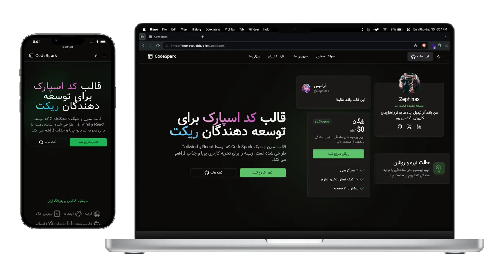

# CodeSpark - StartUp Website Template



### ⚠️ **All names, information and assets used are fake and do not represent a real componany.** ⚠️

## Live Demo

### Take a look the live demo here 👉 [Zephinax.CodeSpark.ir](https://zephinax.github.io/HooBank/)

CodeSpark's modern and sleek landing page design, powered by React and Tailwind, sets the stage for a dynamic and engaging user experience.

## Layout

- Navbar
- Sidebar(mobile)
- Hero
- Sponsors
- About
- Stats
- How It Works
- Features
- Services
- Call-to-Action (CTA)
- Testimonials
- Team
- Pricing
- Newsletter
- Frequently Asked Questions(FAQ)
- Footer

## Features

- Fully Responsive Design
- User Friendly Navigation
- Dark Mode
- Meta tags

## Built With

- React.js
- Tailwind CSS
- Vite

## How to install

1. Clone this repository:

```bash
git clone https://github.com/Zephinax/CodeSpark.git
```

2. Go into project

```bash
cd CodeSpark
```

3. Install dependencies

```bash
npm install
```

4. Run project

```bash
npm run dev
```

Give a ⭐ if you like this project!

## Authors

- [@Zephinax](https://github.com/Zephinax)

  Please give me proper credit by linking back to [Me](https://github.com/Zephinax), Thanks!
